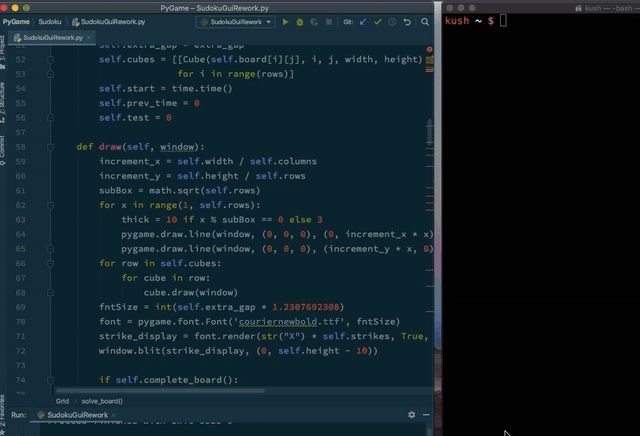

# PyGame
Various PyGame projects including Atari Brealout, Flappy Bird, Mario Space Invader, and Tic Tac Toe

Connect 4 also included, no GUI yet on PyGame, but works on stdout

Seperate Sudoku Solver/GUI which lets user solve the sudoku by themselves, giving correct and incorrect guesses, and also solves the whole board using a backtracking algorithm

